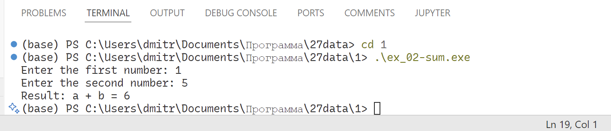

# Лабораторная работа 1 - Математические операции. Переменные и их типы. Операторы. Циклы. Простые условные конструкции. Основы работы со статическими массивами

##  Комплект 1: Начала программирование. Операторы, вычисления, ввод-вывод.

---

### Задача 1.

Установить предложенную для работы среду программирования VSCode.


#### 3.4.3 Математическая модель

$$
\begin{bmatrix} 
a_{11} & a_{12} & a_{13} \\ 
a_{21} & a_{22} & a_{23} \\
a_{31} & a_{32} & a_{33} 
\end{bmatrix} \to 
\begin{bmatrix} 
\frac{a_{11} + a_{12} + a_{13}}{3} & a_{12} & a_{13} \\ 
\frac{a_{21} + a_{22} + a_{23}}{3} & a_{22} & a_{23} \\
\frac{a_{31} + a_{32} + a_{33}}{3} & a_{32} & a_{33} 
\end{bmatrix}
$$

---

### Задача 2

#### Формулировка задачи

Написать простую программу. Ввести два числа с клавиатуры, вычислить их сумму и напечатать результат. Использовать функцию `printf` для приглашений на ввод и для распечатки результата. Использовать функцию `scanf` для ввода каждого числа отдельно с клавиатуры. Для получения доступа к функциям `printf` и scanf включить в программу заголовочный файл `stdio.h`. Использовать корректные спецификаторы форматирования. Здесь и далее для распечатки надписей на экране использовать латинские буквы для избежание проблем с кодировками символов.

#### Математическая модель

$$result = a + b$$

#### Список идентификаторов


| Имя переменной  | Тип данных  | Описание  |
|---|---|---|
|  a | `int`  | Целое число  |
| b  | `int`  | Целое число  |
| result  | `int`  | Целое число - результат сложения |

#### Программа

```c
#include <stdio.h>

int main(void) {
    int a = 0, b = 0;
    int result = 0;

    printf("Enter the first number: ");
    scanf("%d", &a);

    printf("Enter the second number: ");
    scanf("%d", &b);

    result = a + b;

    printf("Result: a + b = %d", result);

    return 0;
}
```

#### Результат (скриншот программы)



---

### Задача 3

#### Постановка задачи

Вычислить значение выражения введя $x$ и $y$ с клавиатуры. Подберите значения аргументов $x$ и $y$ самостоятельно за исключением тривиальных значений. Напечатайте вычисленное значение $u(x, y)$ на экране. Включить в программу заголовочный файл `math.h` для доступа к математическим функциям.

#### Математическая модель

$$
u(x, y) = \frac{1 + \sin^2\left(x + y\right)}{2 + \left\vert x - \frac{2x^2}{1 + \vert \sin(x + y) \vert} \right\vert}
$$

#### Список идентификаторов

| Имя переменной  | Тип данных  | Описание  |
|---|---|---|
| x  | `double`  | Переменная `x`  |
| y  | `double`  | Переменная `y`  |
| numerator  | `double`  | Числитель (вспомогательная переменная)  |
| denominator  | `double`  |  Знаменатель (вспомогательная переменная) |
| u  | `double`  | Значение функции (результат) |

#### Код программы

```c
#include <stdio.h>
#include <math.h>

int main(void) {
    double x, y;
    double sinxy;
    double numerator, denominator; 
    double u;

    printf("Enter the first number: ");
    scanf("%d", &x);

    printf("Enter the second number: ");
    scanf("%d", &y);

    sinxy = sin(x + y);
    numerator = 1 + sinxy * sinxy;
    denominator = 2 + abs( x + 2 * x * x / ( 1 + abs(sinxy) ) ); 

    u = numerator / denominator;

    printf("Result: u(%.3lf, %.3lf) = %.6lf", x, y, u);

    return 0;
}
```

---
